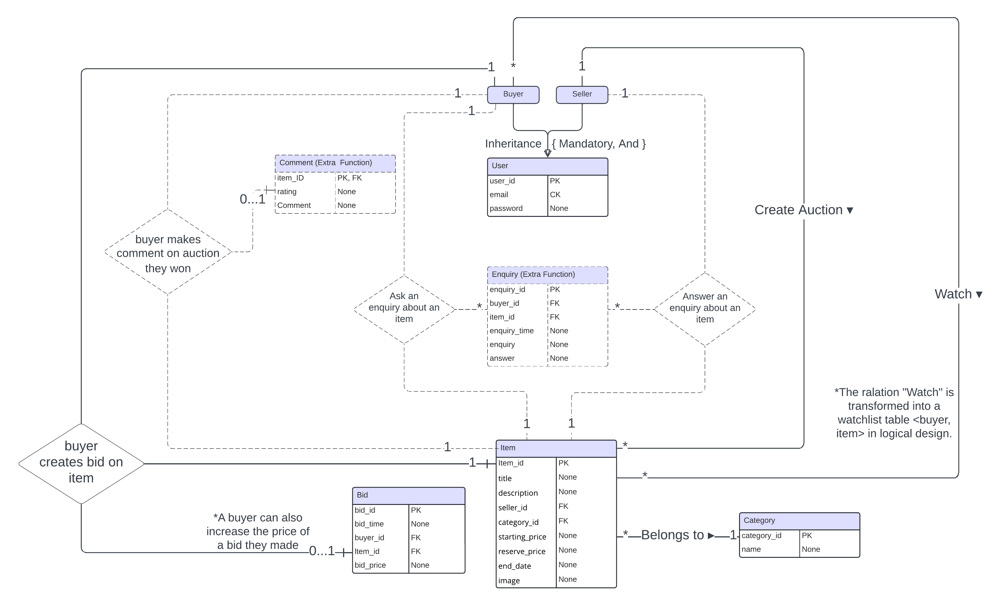
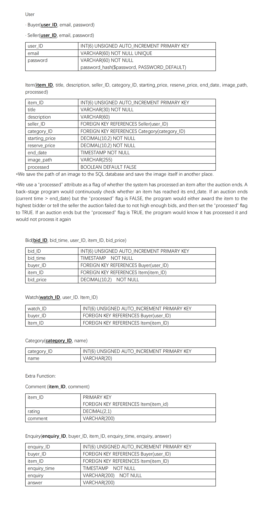

# Introduction #
This is a mock auction program running at the server end. 
The main languages involved are **PHP, SQL, CSS/HTML/JS**.

## Video Demo ##
Display Video of our Program : https://youtu.be/lRaR3d5fOsc

## Core Functionality of this Program ##
√ 1. Users can register with the system and create accounts. Users have roles of seller or buyer with different privileges.

√ 2. Sellers can create auctions for particular items, setting suitable 
conditions and features of the items including the item description, categorisation, starting price, reserve price and end date.

√ 3. Buyers can search the system for particular kinds of item being auctioned and can browse and visually re-arrange listings of items within categories.

√ 4. Buyers can bid for items and see the bids other users make as they are received. The system will manage the auction until the set end time and award the item to the highest bidder. The system should confirm to both the winner and seller of an auction its outcome.

√ E5. Buyers can watch auctions on items and receive emailed updates on bids on those items including notifications when they are outbid.

√ E6. Buyers can receive recommendations for items to bid on based on collaborative filtering (i.e., ‘you might want to bid on the sorts of things other people, who have also bid on the sorts of things you have previously bid on, are currently bidding on).

### Extra Functions: ###

√ E7. **Inqury**

Buyers can make enquiries toward sellers about an item. The seller of the item would receive an email of the question. Buyers can see all Q&As about an item on the detailed listing page of that item.

Sellers can browse all the enquires made on their items. Sellers can answer questions about enquiries. The answers would be sent to enquirers by email.

√ E8. **Comment**

Buyers who won the auction can make comments and ratings on the deal they made. 

Other Users are able to see the comment on a sold item.

Other Users are able to see all the comments on a seller's items sold and the average rating of a seller's items sold.

√ E9. **Item Picture**

Sellers can add pictures to the items they sell when creating auctions.

Users can see the pictures of the items (if available) in the browse.php, and listing.php by clicking the items in the index page.

√ E10. **Deletion of Bids and Items**

Sellers can cancel their auctions. Emails would be sent to all buyers watching the cancelled item.

Buyers can cancel their bids. Emails would be sent to all buyers watching the item if the highest bid changes due to cancellation.

√ E11. **Change Email and Password**

Users can change email to a new one after logging in and sending a verification code to the new email to be set.

Users can change password by sending a verification code to the registered email address.

# Setup #

## Environemnt ##
An environment with PHP and SQL is required. We used XAMPP as the development env.

To enable the email function, follow **[auction/email/readme.md](auction/email/readme.md)**.

## Database ##
Follow the instructions in **auction/data/** to initialize the database.

## Excution ##

Run **auction/back_stage_proc/transaction.php** first at the back stage to start a serving process to end the auctions automatically at the set time. See more information in **[auction/back_stage_proc/readme.md](auction/back_stage_proc/readme.md)**.

Run **index.php** to start the program.

# Program Outline #

## Database Design of this Program ##

Our program design strictly follows the Entity-Relationship design and follows the 1st, 2nd and 3rd database normalization requirements, the ERD and logical design details of which are as follows.

### Entity-Relationship Diagram ###

Note: Entities and Relations related to Basic/Core Functionalities are marked with solid lines; those related to extra functionalities with dotted lines.

### Logical Design ###

# Contributors #

Thanks to Karina (Kenan) Li, Yuna (Chao-Wei) Tseng, Jiayi Chen, Anqi Liu.

See contribution history at [./materials/contribution.md](./materials/contribution.md "contribution.md")
