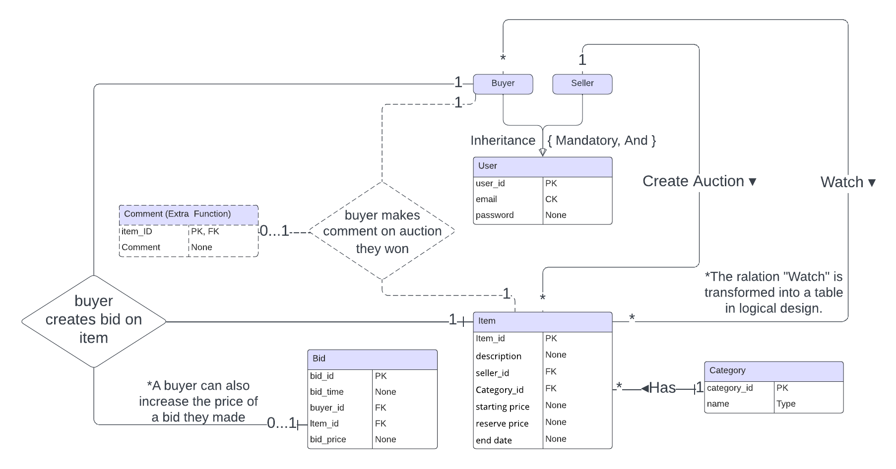
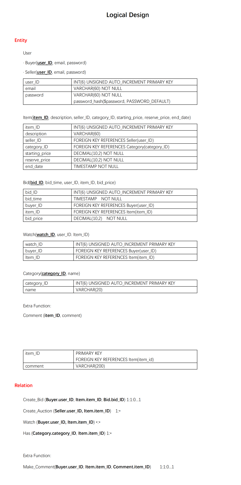

# Contribution History #
When committing each time, please add a note of the changes here. This would become a reference point of mutual evaluation...
Eighth Commit
----------
York :  1/ add the register function in the register.php & process_register.php
2/ add a register botton next to login botton on the main webpage and it also can call the registration function
3/ complement with the content of Fourth Commit 

Seventh Commit
----------
Karina:

Comment Function Completed!

A Buyer (should log in first) who won the auction can make a comment and a rating on the deal they made. 

Other Users are able to see the comment on a sold item.

Other Users are able to see all the comments on a seller's items sold and the average rating of a seller's items sold by clicking the url on the listing page which shows the details of an item.

@ listing.php, extra_func/comment.php, extra_func/process_comment.php

2024.11.09 17:00

Sixth Commit
----------
Karina: modify header.php to make it able to choose between buyer and seller. modify login_result.php to make it more consice and safe and add hash_password function.

Finish all the TODO comments @ browse.php, listing.php and watchlist_fuc.php

Users can now browse, select and sort all the auctions, see details of an auction, and add/remove items to/from watching list. 

TODO: Add email functions. Add functions to automatically end an auction when the deadline arrives. 

2024.11.08 20:00

Fifth Commit
----------
Jiayi:

Fourth Commit
----------
York Tseng: 
1/ Finish login related function in the login result.php
Thanks to Karina's help the password can Extract $_POST variables
finish the request as the following content 
// TODO: Extract $_POST variables, check they're OK, and attempt to login.
// Notify user of success/failure and redirect/give navigation options.

// For now, I will just set session variables and redirect.

2/ modify some parts in header.php in order to to compare the user login password with the database we created 
the function is related to the do in header.php as the following cotnet
  // FIXME: At the moment, I've allowed these values to be set manually.
  // But eventually, with a database, these should be set automatically
  // ONLY after the user's login credentials have been verified via a 
  // database query.

Third Commit
----------
York Tseng: upload the ER diagram and the logical design.

2024.11.02 18:45

Second Commit 
----------
Karina: Implement the codes to create our database and tables.

@ auction/data/

2024.10.31 19:00

First Commit 
----------
Karina: Create the project on GitHub. Commit the starter code from moodle.

2024.10.16 17:00

# Setup #

## Environemnt ##
An environment with PHP and SQL is required. We used XAMPP as the development env.

## Database ##
Follow the instructions in **auction/data/** to initialize the database.

## Excution ##
Run **auction/index.php** to start the program.

# Program Outline #

## Introduction ##
This is a mock auction program running at the server end. 
The main languages involved are **PHP, SQL, CSS/HTML/JS**.

Our program design strictly follows the Entity-Relationship design and follows the 1st, 2nd and 3rd database normalization requirements, the ERD and logical design details of which are as follows.

## Entity-Relationship Diagram ##

## Logical Design ##

## Core Functionality Implemented ##
⚪ 1. Users can register with the system and create accounts. Users have roles of seller or buyer with different privileges.

⚪ 2. Sellers can create auctions for particular items, setting suitable 
conditions and features of the items including the item description, categorisation, starting price, reserve price and end date.

√ 3. Buyers can search the system for particular kinds of item being auctioned and can browse and visually re-arrange listings of items within categories.

⚪ 4. Buyers can bid for items and see the bids other users make as they are received. The system will manage the auction until the set end time and award the item to the highest bidder. The system should confirm to both the winner and seller of an auction its outcome.

⚪ E5. Buyers can watch auctions on items and receive emailed updates on bids on those items including notifications when they are outbid.

⚪ E6. Buyers can receive recommendations for items to bid on based on collaborative filtering (i.e., ‘you might want to bid on the sorts of things other people, who have also bid on the sorts of things you have previously bid on, are currently bidding on).

**Extra Functions:**

√ E7. 

Buyers who won the auction can make comments and ratings on the deal they made. 

Other Users are able to see the comment on a sold item.

Other Users are able to see all the comments on a seller's items sold and the average rating of a seller's items sold.
