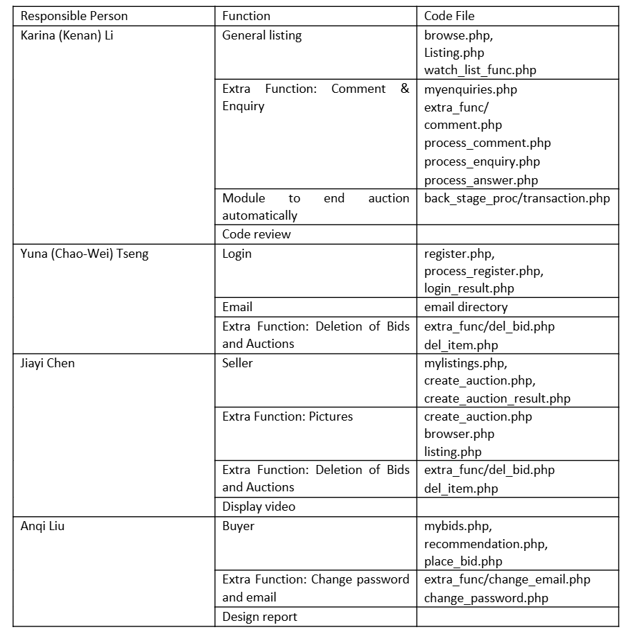

# Labor Division #

# Contribution History #
When committing each time, please add a note of the changes here. This would become a reference point of mutual evaluation...

22st commit
----------
Anqi:

Change password/email functions DONE

Users can change their password and email at browse page, through clicking the top button "ChangeEmail" or "ChangePassword"
Users will receive the verifiction code to verify their authentication.
Once their changed their password or email, it will logout automatically. Users have to log in again.

@auction/extra_func/change_password.php
@auction/extra_func/change_email.php

2024.11.24

21st commit
----------
Karina:

Inquiry functions DONE

Buyers can make enquiries toward sellers about an item in the detailed listing page of an item. The seller of the item would receive an email of the question. Buyers can see all Q&As about an item on the detailed listing page of that item.

Sellers can browse all the enquires made on their items in "My Enquiries". Sellers can answer questions about enquiries after clicking on the enquiry links in "My Enquiries". The answers would be sent to enquirers by email.

@ auction/  myenquiries.php 
@ auction/extra_func/  seller_enquiry.php, buyer_enquiry.php, process_enquiry.php, process_answer.php

2024.11.24

20th commit
----------
Chao-Wei:
1. upload the updated del_bid.php & del_item.php files to extra funcs file
2. watchers and sellers would receive an email when the products they are watching are deleted
3. buyers and watchers would receive an email when the prices of products are changed i.e. someone deleted a bid, loweing the highest bid amount 

19th commit
----------
Jiayi: 

now pictures of items can be added when creating auctions and can be shown in the browse page and the item detail page

finished deletion ops in del_bid.php & del_item.php. TODO: send email notifications.

18th commit
----------

Chao-Wei:
1. upload the updated listing.php & header.php made by Karina 
2. upload four files, change_email.php, change_password.php, del_bid.php and del_item.php by Karina, within extra funcs file for extra functions

2024.11.21 2:51

17th commit
----------

Chao-Wei:

solve issues within my_bid.php 

2024.11.20 11:34

16th commit
----------
Karina:

Moved email codes all into the email directory. Moved all email parameters (address, password etc.) into email/config.json

Modifications to place_bid.php and transaction.php. Now emails can be sent when users place bids / are outbidded / the auction ends.

Compiled the instructions to enable email functions into [auction/email/readme.md](auction/email/readme.md)

2024.11.18 18:00

15th commit
----------

Chao-Wei:
1. change several parts within place_bid.php, uitilities.php, and added a file called vendor to store the files needed for the project.
2. The vendors file is related to phpmailer, which is used to send emails.
3. The webiste now can send emails to the user to notify them of the pricee of the item they are bidding on.
4. The following parts contains how to set up the environment for the project.
5. Environment Setup:

5. 1. Download and install Composer.
Since I have already included the vendor folder with all necessary files in the project, there is no need to run additional commands.
Composer website: https://getcomposer.org/

5. 2. Next Steps:
Locate the php.ini file at the following path:
C:\xampp\php\php.ini
Open the file and use Ctrl + F to search for the following keywords. Modify the parameters as shown below:
[mail function]
SMTP = smtp.gmail.com
smtp_port = 587
sendmail_from = you@example.com ; Set this to your email address
sendmail_path = "\"C:\xampp\sendmail\sendmail.exe\" -t"

5. 3. Go to your Google account and enable two-step verification.
After enabling it, visit https://myaccount.google.com/apppasswords to generate a 16-digit app password. This is important; consider taking a screenshot to save it.

14th commit
----------
Karina: 

Finished the codes to automatically end an auction. See auction/back_stage_proc for details. Waiting for the email function to be completed to fully realize the function.

Addition to an omission: add bidding history to listing.php according to hw requirements.

Note that index.py has been moved out of the auction directory to make the codes more layered.

2024.11.15 8:40

13th commit
----------
Anqi: filled TODO in mybids.php, place_bid.php, recommendations.php. Haven't tested the codes yet.

12th commit
----------
Jiayi Chen:
Fixed some presentation bugs

11th commit
----------
Jiayi Chen:
1. Completed the tasks of creating three files, create_auction,create_auction_result,mylistings. Sellers can create their own products and see information in mylistenings

2. Added the field 'image_path' in the item table to store the path of uploaded photos, which can be viewed in the 'uploads' file

10th commit
----------
Anqi Liu: mybids.php DONE

Ninth Commit
----------
Chao-Wei:
1. change the email in buyer and seller to be unique so that the identical email can't register on the website
2. register function is tested, and it's done

2024.11.13 04:31

Eighth Commit
----------
Chao-Wei:
1. Added the registration function in `register.php` and `process_register.php`.
2. Added a register button next to the login button on the main webpage, which can also call the registration function.
3. Complemented the content of the Fourth Commit.

2024.11.11 1:07 

Seventh Commit
----------
Karina:

Comment Function Completed!

A Buyer (should log in first) who won the auction can make a comment and a rating on the deal they made. 

Other Users are able to see the comment on a sold item.

Other Users are able to see all the comments on a seller's items sold and the average rating of a seller's items sold by clicking the url on the listing page which shows the details of an item.

@ listing.php, extra_func/comment.php, extra_func/process_comment.php

2024.11.09 17:00

Sixth Commit
----------
Karina: modify header.php to make it able to choose between buyer and seller. modify login_result.php to make it more consice and safe and add hash_password function.

Finish all the TODO comments @ browse.php, listing.php and watchlist_fuc.php

Users can now browse, select and sort all the auctions, see details of an auction, and add/remove items to/from watching list. 

TODO: Add email functions. Add functions to automatically end an auction when the deadline arrives. 

2024.11.08 20:00

Fifth Commit
----------
Jiayi: functions to create auctions for sellers.

2024.11.07

Fourth Commit
----------
Chao-Wei: 
1. Finish login related function in the login result.php
Thanks to Karina's help the password can Extract $_POST variables
finish the request as the following content 
// TODO: Extract $_POST variables, check they're OK, and attempt to login.
// Notify user of success/failure and redirect/give navigation options.

// For now, I will just set session variables and redirect.

2. modify some parts in header.php in order to to compare the user login password with the database we created 
the function is related to the do in header.php as the following cotnet
  // FIXME: At the moment, I've allowed these values to be set manually.
  // But eventually, with a database, these should be set automatically
  // ONLY after the user's login credentials have been verified via a 
  // database query.

2024.11.11 12:36

Third Commit
----------
York Tseng: upload the ER diagram and the logical design.

2024.11.02 18:45

Second Commit 
----------
Karina: Implement the codes to create our database and tables.

@ auction/data/

2024.10.31 19:00

First Commit 
----------
Karina: Create the project on GitHub. Commit the starter code**.

2024.10.16 17:00